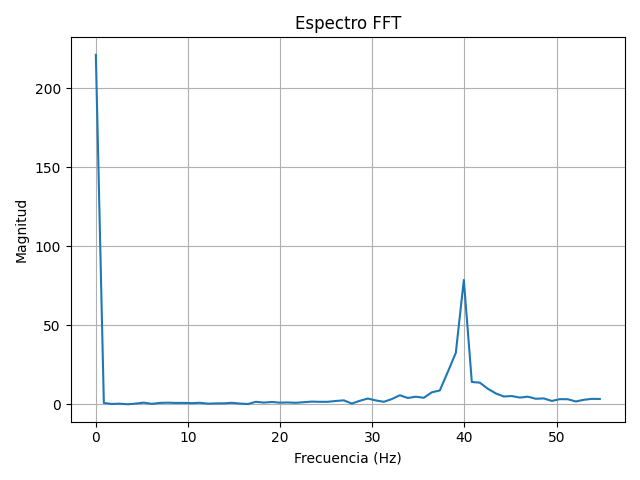
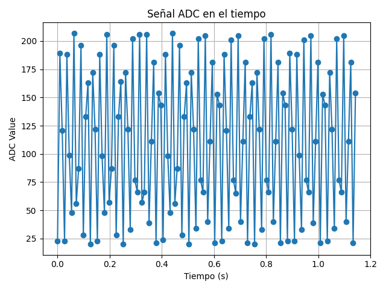
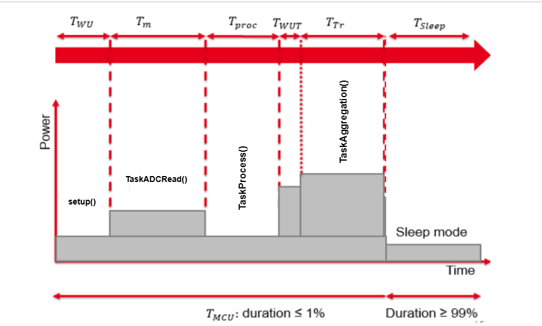

# 📡 IoT Adaptive Sampling System

**Author:** Marcelo Jiménez
**Platform:** ESP32 + FreeRTOS  
**Course:** IoT Performance Evaluation  
**Repository:** https://github.com/MarceloJimenez/IoTSignalProcessing

---

## 🧠 Project Overview

This project implements an **IoT system** in a ESP32 board (WROOM-32 Devkit)that:
- Samples a real analog signal 
- Analyzes it via FFT to detect the highest frequency,
- Adapts the sampling rate accordingly (Nyquist criterion),
- Computes the average value over a 5-second window,
- Sends this aggregate to:
  - A **local edge server** using MQTT over WiFi,
  - The **cloud** via **LoRaWAN + TTN** (NOT IMPLEMENTES YET)
- Evaluates energy savings, transmission volume, and system latency.

---

## ⚙️ System Architecture

```
  [DAC Signal Generator] -> [ADC Sampler - ESP32 (FreeRTOS)] -> [FFT Analysis]
                                                          ↘︎
                                                         [Adaptive Sampling]
                                                          ↘︎
                                                      [Aggregator (5s)]
                                                    ↙︎              ↘︎
                  [MQTT + WiFi to Edge Server]   [LoRaWAN + TTN to Cloud]
```

---

## 📡 Input Signal

The input is a synthetic signal:


Generated using DAC on ESP32 (see `Sampling1.ino`).

---

## 🚀 How to Run

## 📡 External Dependencies
- ESP32 board (WROOM-32 Devkit)
- Python + `matplotlib`, `numpy`, `scipy`, `pyserial`
- Arduino + 
- [arduinoFFT](https://github.com/kosme/arduinoFFT) – For FFT computation
- [WiFi.h](https://www.arduino.cc/en/Reference/WiFi) – For WiFi connectivity
- [PubSubClient](https://pubsubclient.knolleary.net/) – For MQTT communication

---


### ✅ Setup
0. Flash `Max_Freq.ino` to measure the maximun sampling frequency of ESP32: **20757.91 Hz**

1. Flash `Sampling1.ino` to ESP32 (signal generator + ADC)\
2. Open the serial port to see the messages of the implementation. 
3. Execute `plot2.py` to see the received data and the FFT. (Check first if the code in the line 95/97 of `Sampling1.ino` are not comented )

        // To use plot2.py uncomment this:
        // Serial.print(micros());
        // Serial.print(",");
        // Serial.println(adc_data.adc_value);

---

### Images of the Plot2.py




## 🔐 Measurements of the performance

- **Energy consumption**

Here its a diagram of the qualitative energy consumption of the system: 


As we can see in the image, we expect that the TaskAgreggation function will use most of the energy because its the function that sends the data via WIFI/MQTT

- **Volume of data**

The maximun sampling frequency of the system is aproximately 20.000 Hz. The frequency that we are using its 120 Hz

So we have a reduction factor of approximately 166.67 of the volume of data procesed by the IoT system.


---

## 📁 Folder Structure

```
├── Sampling1.ino            # DAC + ADC signal
├── Max_Freq.ino             # Max sampling test
├── README.md
└── doc/                     # Energy measurements, signal plots, etc.
```

---

Here's a `README.md` file in Markdown format that explains each function in your ESP32 signal processing project:

---

# Code Explanation

This project implements a real-time, dual-core signal processing system using the ESP32. It generates sine waves via DAC, samples them with the ADC, processes the data using FFT, adjusts the sampling frequency dynamically, and sends aggregated results via MQTT.

---

## 📂 Project Structure

The system is composed of several FreeRTOS tasks, distributed between the two cores of the ESP32:

| Task Name         | Core | Purpose                                      |
|-------------------|------|----------------------------------------------|
| `TaskDACWrite`    | 0    | Sine wave generation via DAC                |
| `TaskProcess`     | 0    | Signal processing using FFT and adaptation  |
| `TaskAggregation` | 0    | Computes 5-second rolling average + MQTT    |
| `TaskADCRead`     | 1    | High-frequency ADC sampling                 |

---

## 📌 Functions Explained

### `setup()`
Initializes all system components:
- Connects to WiFi and MQTT broker.
- Sets up queues for inter-task communication.
- Spawns all FreeRTOS tasks and binds them to specific cores.

---

### `loop()`
Left intentionally empty, except for MQTT keep-alive:
- Reconnects MQTT if disconnected.
- Runs `client.loop()` to maintain MQTT communication.

---

### `connectToWiFi()`
Attempts to connect to the specified WiFi network:
- Tries up to 2 times before reporting failure.

---

### `connectToMQTT()`
Attempts to connect to the MQTT broker:
- Tries up to 2 times.
- Sets `mqtt_connected` flag if successful.

---

### `TaskDACWrite(void *pvParameters)`
Runs on **Core 0**. Continuously generates a sine wave:
- Uses `dacWrite()` to output values at a fixed rate (`dacUpdateRate`).
- Computes sine values using a phase accumulator.

---

### `TaskADCRead(void *parameter)`
Runs on **Core 1**. Performs high-speed ADC sampling:
- Samples at a rate controlled by `sampleFrequency`.
- Sends each reading (plus timing delta) to two queues: `sampleQueue` (for FFT) and `aggQueue` (for averaging).
- Optionally outputs data over serial for plotting.

---

### `TaskProcess(void *pvParameters)`
Runs on **Core 0**. Performs FFT-based signal processing:
- Collects `FFT_SAMPLE_SIZE` samples from `sampleQueue`.
- Computes the real-time sampling frequency.
- Applies a Hamming window, computes the FFT, filters low bins.
- Calculates magnitude spectrum and estimates peak frequency.
- Dynamically adjusts `sampleFrequency` to 3× the detected frequency.

---

### `TaskAggregation(void *param)`
Runs on **Core 0**. Calculates and publishes rolling average:
- Aggregates ADC values from `aggQueue` over 5-second windows.
- Publishes the average value to the MQTT topic.
- Handles failed MQTT publish attempts gracefully.

---

## 🧰 System Configuration

| Constant              | Value               | Purpose                                      |
|-----------------------|---------------------|----------------------------------------------|
| `FFT_SAMPLE_SIZE`     | 128                 | Number of samples per FFT cycle              |
| `DAC_PIN`             | 25                  | GPIO pin used for DAC output                 |
| `ADC_PIN`             | 34                  | GPIO pin used for ADC input                  |
| `frequency`           | 40.0 Hz             | Base sine wave frequency                     |
| `sampleFrequency`     | 20000.0 Hz (initial)| Initial ADC sampling frequency               |
| `mqtt_topic`          | `iot/aggregate`     | MQTT topic for average data publishing       |

---


## 📣 Notes

This project was developed as part of the IoT Performance Evaluation course.  
All work (code and documentation) is individual and original, following the academic integrity policy.

