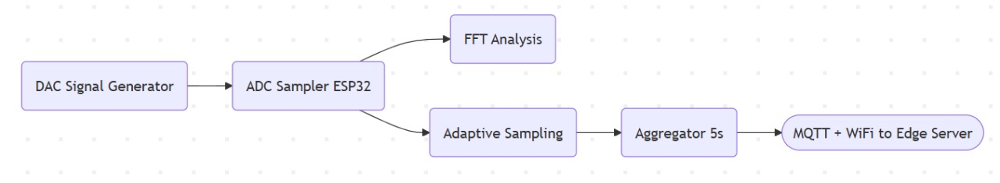

# 📡 IoT Adaptive Sampling System

**Author:** Marcelo Jiménez  
**Platform:** ESP32 + FreeRTOS  
**Course:** IoT Performance Evaluation  
**Repository:** [GitHub Repository](https://github.com/MarceloJimenez/IoTSignalProcessing)

---

## 🧠 Project Overview

This project implements an **IoT system** on an ESP32 board that processes a synthetic input signal of the form:

**Input Signal:**  
`SUM(a_k * sin(2 * π * f_k * t))`  
For example: `2 * sin(2 * π * 3 * t) + 4 * sin(2 * π * 5 * t)`

The system performs the following tasks:
1. **Generates the input signal** using the DAC.
2. **Samples the signal** using the ADC at a dynamically adjusted frequency.
3. **Analyzes the signal** using FFT to detect the highest frequency component.
4. **Adapts the sampling frequency** based on the Nyquist criterion.
5. **Computes the average** of the sampled signal over a 5-second window.
6. **Transmits the aggregate value** to:
  - A **local edge server** using MQTT over WiFi.
  - The **cloud** via **LoRaWAN + TTN**.

---

## ⚙️ System Architecture



---

## 🚀 Hands-On Walkthrough

### ✅ Step 1: Measure Maximum Sampling Frequency
1. Flash `Max_Freq.ino` to the ESP32.
2. Open the serial monitor to observe the maximum sampling frequency.  
  Example output: **Maximum Sampling Frequency = 20757.91 Hz**

---

### ✅ Step 2: Generate and Sample the Input Signal
1. Flash `Sampling1.ino` to the ESP32.
2. The DAC generates a synthetic signal of the form `SUM(a_k * sin(2 * π * f_k * t))`.  
  Example: `2 * sin(2 * π * 3 * t) + 4 * sin(2 * π * 5 * t)`
3. The ADC samples the signal at a dynamically adjusted frequency.

---

### ✅ Step 3: Perform FFT and Adapt Sampling Frequency
1. The system computes the FFT of the sampled signal to identify the highest frequency component (`f_max`).
2. The sampling frequency is dynamically adjusted to `2 * f_max` (Nyquist criterion).  
  Example: If `f_max = 5 Hz`, the sampling frequency is set to `10 Hz`.

---

### ✅ Step 4: Compute Aggregate Function
1. The system computes the **average** of the sampled signal over a 5-second window.
2. This rolling average is calculated in the `TaskAggregation` function.

---

### ✅ Step 5: Transmit Aggregate Value
1. **To Edge Server:**  
  - The average value is transmitted to a nearby edge server using MQTT over WiFi.
  - MQTT Topic: `iot/aggregate`
2. **To Cloud:**  
  - The average value is transmitted to the cloud using LoRaWAN via The Things Network (TTN).  
  - **Note:** LoRaWAN implementation is planned for future updates.

---

## 📡 External Dependencies
- **Hardware:** ESP32 board (WROOM-32 Devkit)
- **Python Libraries:** `matplotlib`, `numpy`, `scipy`, `pyserial`
- **Arduino Libraries:**
  - [arduinoFFT](https://github.com/kosme/arduinoFFT) – For FFT computation
  - [WiFi.h](https://www.arduino.cc/en/Reference/WiFi) – For WiFi connectivity
  - [PubSubClient](https://pubsubclient.knolleary.net/) – For MQTT communication

---

## 📁 Folder Structure

```
├── Sampling1.ino            # DAC + ADC signal
├── Max_Freq.ino             # Max sampling test
├── README.md
└── doc/                     # Energy measurements, signal plots, etc.
```

---

## 📌 Technical Details

### Input Signal
The input signal is generated using the DAC on the ESP32. It is a sum of sine waves with configurable amplitudes (`a_k`) and frequencies (`f_k`).

### Maximum Sampling Frequency
The maximum sampling frequency of the ESP32 is approximately **20,757.91 Hz**, as measured using `Max_Freq.ino`.

### Optimal Sampling Frequency
The system dynamically adjusts the sampling frequency to **2 × f_max**, where `f_max` is the highest frequency component detected via FFT.

### Aggregate Function
The system computes the **average** of the sampled signal over a 5-second window. This rolling average is transmitted to both the edge server and the cloud.

### Communication
1. **MQTT over WiFi:**  
  - The average value is published to the MQTT topic `iot/aggregate`.
2. **LoRaWAN + TTN:**  
  - The average value is transmitted to the cloud via LoRaWAN (future implementation).

---

## 📊 Energy Consumption

### **Qualitative Energy Consumption**
The following diagram shows the qualitative energy consumption of the system:  


- **TaskAggregation** is expected to consume the most energy because it involves sending data via WiFi/MQTT, which is energy-intensive.
- **Deep Sleep** significantly reduces energy consumption when the device is idle.

---

### **Quantitative Energy Measurements**

#### **1. Device Waking Up and Reconnecting to WiFi**
  
- **Observation:** Energy spikes during WiFi reconnection after deep sleep.

#### **2. Default Energy Consumption During Sampling**
  
- **Observation:** The device consumes a steady amount of energy while sampling and processing data.

#### **3. Device Entering Deep Sleep**
  
- **Observation:** Energy consumption drops significantly when the device enters deep sleep.

---

### **Energy Optimization**
1. **Adaptive Sampling Frequency**:
   - Reduces the number of samples processed, lowering energy consumption.
   - Example: Sampling at 20 Hz instead of 20,000 Hz reduces energy usage by a factor of 1000.

2. **Deep Sleep**:
   - The ESP32 enters deep sleep for 10 seconds every minute, significantly reducing idle energy consumption.

3. **Efficient Communication**:
   - MQTT messages are sent only when necessary (e.g., every 5 seconds), minimizing WiFi usage.

---

## 📦 Volume of Data

### **Maximum Sampling Frequency**
- The system's maximum sampling frequency is approximately **20,000 Hz**.

### **Current Sampling Frequency**
- The system dynamically adjusts the sampling frequency based on the Nyquist criterion. For example:
  - If the highest frequency component is 5 Hz, the sampling frequency is set to 10 Hz.
  - In this implementation, the sampling frequency is typically **20 Hz**.

### **Data Reduction**
- By reducing the sampling frequency from 20,000 Hz to 20 Hz, the system achieves a **data reduction factor of ~1000**.


# Code Explanation

This project implements a real-time, dual-core signal processing system using the ESP32. It generates sine waves via DAC, samples them with the ADC, processes the data using FFT, adjusts the sampling frequency dynamically, and sends aggregated results via MQTT.

---

## 📂 Project Structure

The system is composed of several FreeRTOS tasks, distributed between the two cores of the ESP32:

| Task Name         | Core | Purpose                                      |
|-------------------|------|----------------------------------------------|
| `TaskDACWrite`    | 0    | Sine wave generation via DAC                |
| `TaskProcess`     | 0    | Signal processing using FFT and adaptation  |
| `TaskAggregation` | 0    | Computes 5-second rolling average + MQTT    |
| `TaskADCRead`     | 1    | High-frequency ADC sampling                 |

---

## 📌 Functions Explained

### `setup()`
Initializes all system components:
- Connects to WiFi and MQTT broker.
- Sets up queues for inter-task communication.
- Spawns all FreeRTOS tasks and binds them to specific cores.

---

### `loop()`
Left intentionally empty, except for MQTT keep-alive:
- Reconnects MQTT if disconnected.
- Runs `client.loop()` to maintain MQTT communication.

---

### `connectToWiFi()`
Attempts to connect to the specified WiFi network:
- Tries up to 2 times before reporting failure.

---

### `connectToMQTT()`
Attempts to connect to the MQTT broker:
- Tries up to 2 times.
- Sets `mqtt_connected` flag if successful.

---

### `TaskDACWrite(void *pvParameters)`
Runs on **Core 0**. Continuously generates a sine wave:
- Uses `dacWrite()` to output values at a fixed rate (`dacUpdateRate`).
- Computes sine values using a phase accumulator.

---

### `TaskADCRead(void *parameter)`
Runs on **Core 1**. Performs high-speed ADC sampling:
- Samples at a rate controlled by `sampleFrequency`.
- Sends each reading (plus timing delta) to two queues: `sampleQueue` (for FFT) and `aggQueue` (for averaging).
- Optionally outputs data over serial for plotting.

---

### `TaskProcess(void *pvParameters)`
Runs on **Core 0**. Performs FFT-based signal processing:
- Collects `FFT_SAMPLE_SIZE` samples from `sampleQueue`.
- Computes the real-time sampling frequency.
- Applies a Hamming window, computes the FFT, filters low bins.
- Calculates magnitude spectrum and estimates peak frequency.
- Dynamically adjusts `sampleFrequency` to 3× the detected frequency.

---

### `TaskAggregation(void *param)`
Runs on **Core 0**. Calculates and publishes rolling average:
- Aggregates ADC values from `aggQueue` over 5-second windows.
- Publishes the average value to the MQTT topic.
- Handles failed MQTT publish attempts gracefully.

---

## 🧰 System Configuration

| Constant              | Value               | Purpose                                      |
|-----------------------|---------------------|----------------------------------------------|
| `FFT_SAMPLE_SIZE`     | 128                 | Number of samples per FFT cycle              |
| `DAC_PIN`             | 25                  | GPIO pin used for DAC output                 |
| `ADC_PIN`             | 34                  | GPIO pin used for ADC input                  |
| `frequency`           | 10.0 Hz   + 5 Hz          | Base sine wave frequency                     |
| `sampleFrequency`     | 50 Hz (initial)| Initial ADC sampling frequency               |
| `mqtt_topic`          | `iot/aggregate`     | MQTT topic for average data publishing       |

---


## 📣 Notes

This project was developed as part of the IoT Performance Evaluation course.  
All work (code and documentation) is individual and original, following the academic integrity policy.

